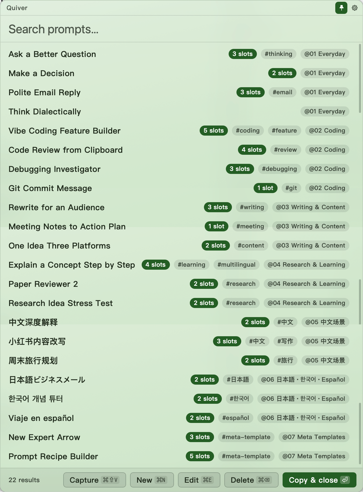
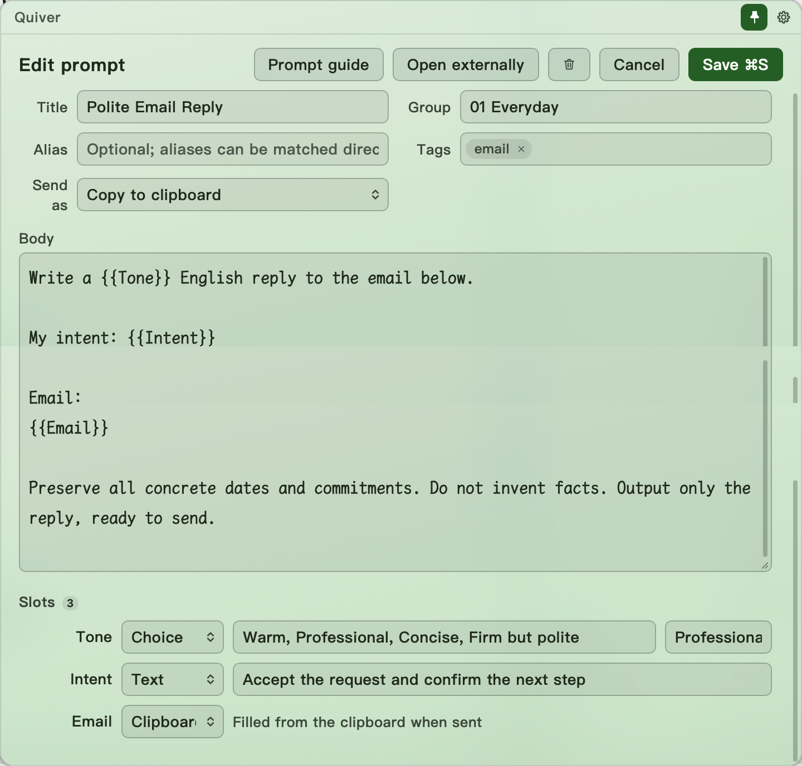
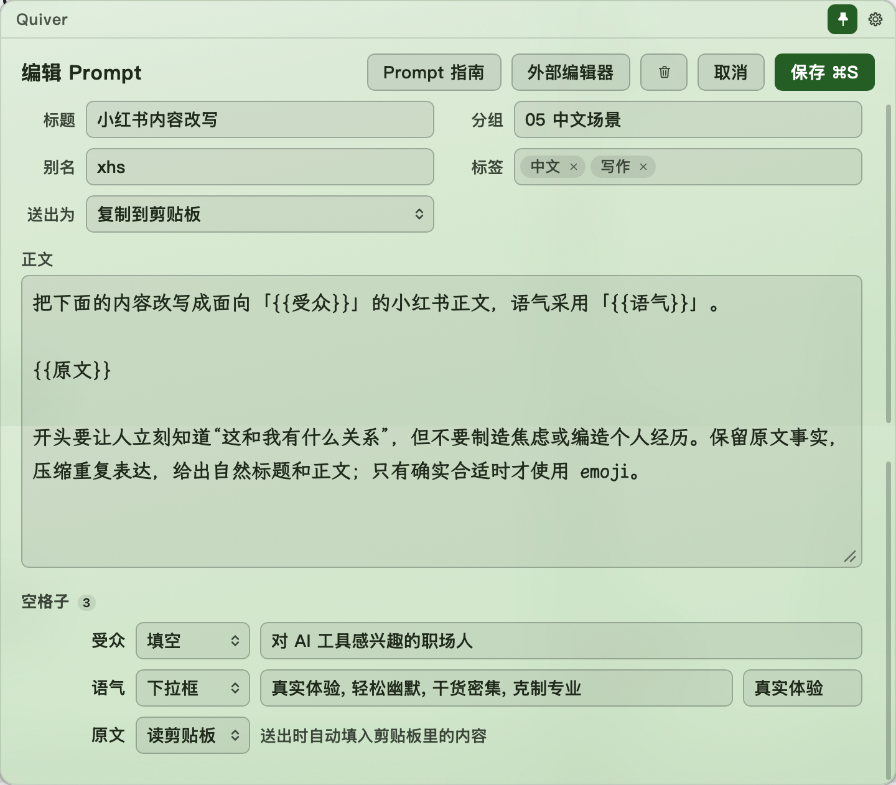
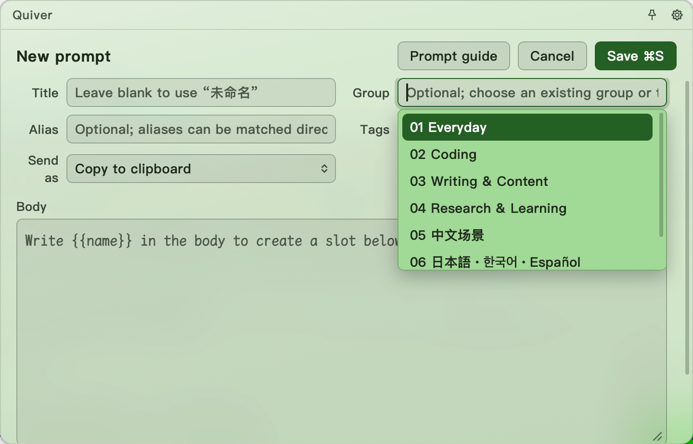
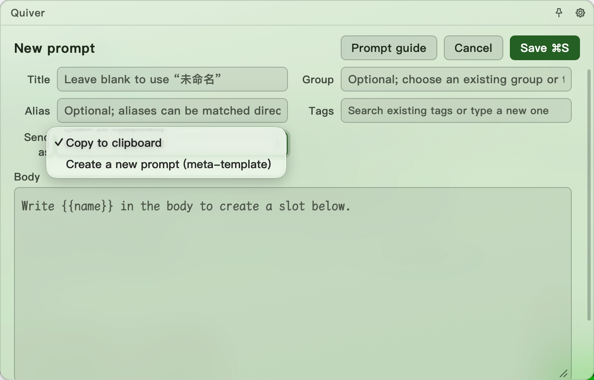

# Quiver

[English](README.md) · [简体中文](README.zh-CN.md) · [한국어](README.ko.md)

**macOS용 로컬 우선 프롬프트 관리자이자 재사용 가능한 템플릿 런처.**

## Why｜왜 Quiver인가요?

아직도 여기저기 모은 프롬프트를 Notion, Typora, Obsidian에 적어 두나요? 아직도
매번 직접 복사하고 붙여 넣나요—새끼손가락은 괜찮은가요? 어렵게 찾은 프롬프트를
한 번 쓰고, 다음에는 또 잃어버리나요?

한 시간 동안 다듬은 프롬프트를 다음번에 또 다시 쓰나요? 작업은 5분,
프롬프트는 2시간인가요?

**Quiver**를 사용해 보세요. 프롬프트를 **Arrow**로 저장하고 바뀌는 부분만 슬롯으로
만들면, 다음에는 검색하고 채우고 발사하면 됩니다. 같은 뼈대에 새 내용만 바꿔
반복해서 쓰고, 다른 사람도 바로 바꿔 쓸 수 있게 공유할 수 있습니다.

물론 가벼운 범용 프롬프트 관리자이기도 합니다. 짧은 문구, 완성된 프롬프트,
입력형 템플릿, 긴 전문 지시문까지 모두 담을 수 있습니다. Skill이나 MCP로 만들기엔
너무 작지만 계속 다시 쓰게 되나요? 바로 그 자리가 Quiver의 자리입니다.


## What｜Arrow란 무엇인가요?

저장된 프롬프트 하나하나는 **Arrow(화살)**입니다. 안정된 골격은 유지하고,
매번 달라지는 부분만 표시하세요.

```markdown
{{관점}}에서 {{개념}}을 설명하고, 유도 과정과 {{대상}}을 위한 완전한
예제를 포함하세요. {{언어}}로 답하세요.
```

Quiver는 각 `{{슬롯}}`을 작은 입력 양식으로 바꿉니다. 값을 채우고 완성된
프롬프트를 미리 본 뒤 AI 채팅, IDE 또는 터미널에 복사할 수 있습니다.

슬롯이 없어도 바로 복사할 수 있는 Arrow입니다. 모든 Arrow는 일반 Markdown
파일이므로 Quiver가 없어도 읽고, 옮기고, 공유할 수 있습니다.

## Where｜어떤 도구 사이에 있나요?

| 필요한 일 | 가장 알맞은 도구 |
|---|---|
| 방금 떠오른 내용을 더 빠르게 표현 | 음성 입력 또는 스마트 키보드 |
| 정확한 문구나 텍스트 골격을 재사용 | **Quiver** |
| 도구를 호출하거나 자율 워크플로를 반복 | Skill, MCP 또는 에이전트 |

기준은 길이가 아니라 동작입니다. 가치가 문구에 있고 직접 선택했을 때만
컨텍스트에 넣고 싶다면 Arrow로 보관하세요. 도구 호출이나 자동 행동이 필요해질
때 워크플로로 확장하면 됩니다.

## How｜어떻게 사용하나요?

1. 전용 폴더에 프롬프트를 `.md` 파일로 저장합니다.
2. Quiver에서 설정한 전역 단축키를 누릅니다.
3. 기억나는 단어로 검색합니다.
4. 슬롯을 채우고 `Return`을 눌러 완성된 프롬프트를 복사합니다.

제목, 태그, 그룹, 본문을 함께 퍼지 검색하며 최근에 자주 사용한 Arrow가 별도
모드 없이 자연스럽게 위로 올라옵니다.

## Showcase｜실제로는 어떤 모습인가요?

<table>
  <tr>
    <td width="42%" rowspan="2" valign="top">
      
      <br><sub><strong>하나의 화살통, 여러 종류의 Arrow.</strong> 완성형 프롬프트, 입력형 템플릿, 다국어 자료를 같은 검색 라이브러리에 보관합니다.</sub>
    </td>
    <td width="58%" valign="top">
      
      <br><sub><strong>반복해서 고치는 부분만 슬롯으로 만드세요.</strong> 선택지, 자유 입력, 현재 클립보드를 한 템플릿에서 조합할 수 있습니다.</sub>
    </td>
  </tr>
  <tr>
    <td width="58%" valign="top">
      
      <br><sub><strong>템플릿 골격은 언어에 묶이지 않습니다.</strong> 실제 작업에 필요한 언어로 Arrow를 작성하고 정리하고 재사용하세요.</sub>
    </td>
  </tr>
</table>

<table>
  <tr>
    <td width="50%" valign="top">
      
      <br><sub><strong>별도 장부 없이 정리하세요.</strong> 작성 중에 기존 그룹을 재사용하거나 새 그룹을 바로 입력할 수 있습니다.</sub>
    </td>
    <td width="50%" valign="top">
      
      <br><sub><strong>Arrow가 또 다른 Arrow를 만들 수도 있습니다.</strong> 메타 템플릿은 채운 골격을 새로운 로컬 프롬프트로 저장합니다.</sub>
    </td>
  </tr>
</table>

## Tips｜알아 두면 좋은 사용법

### 먼저 Capture하고 나중에 정리하기

남겨 둘 내용을 복사했다면 Quiver를 불러 **Capture**를 누르거나 `⌘⇧V`를
누르세요. 클립보드가 즉시 Arrow가 되고, 제목과 `#收纳箱`(Capture) 태그도
자동으로 붙습니다. 가져오기 창은 뜨지 않습니다. 나중에 `收纳箱`을 검색해
이름을 바꾸고 그룹을 정하거나 템플릿으로 만들 수 있습니다.

### AI Agent가 화살통을 채우게 하기

설정에 표시되는 **Prompt 폴더**가 Quiver의 루트 라이브러리이며, 모든 Arrow는
일반 Markdown 파일입니다. 따라서 파일을 다룰 수 있는 AI Agent에게 이 폴더
안에서 여러 `.md` 프롬프트를 직접 생성, 번역, 정리하게 하면 하나씩 가져올
필요가 없습니다. 외부 변경은 다음번에 Quiver를 불렀을 때 반영되며, 본문만 있는
Markdown도 작동하고 `{{이름}}`을 쓰면 입력 가능한 슬롯이 됩니다.

일반 메모 보관함이 아닌 전용 프롬프트 폴더만 Agent에게 제공하고, 대량으로
쓰기 전에는 생성할 파일 이름을 먼저 검토하세요.

## Now｜현재 무엇을 할 수 있나요?

- 하나의 사용자 지정 단축키로 현재 앱 위에 Quiver를 불러옵니다.
- 완성된 프롬프트와 템플릿을 만들고 편집하고 검색하고 정리합니다.
- 텍스트, 선택지, 클립보드 슬롯과 실시간 미리보기를 사용합니다.
- 설정에서 영어와 중국어 간체 인터페이스를 전환합니다.
- 야간, 주간, 저청색, 색각 친화, 고대비 테마를 선택합니다.
- 계정이나 프롬프트 본문 업로드 없이 모든 콘텐츠를 로컬에 보관합니다.

프롬프트 파일이 항상 원본입니다. Quiver가 안정적인 `id`와 `updated_at`
메타데이터를 추가할 수 있지만 사용 기록은 다시 만들 수 있는 로컬 캐시에만
남습니다.

이 저장소는 Quiver의 공식 배포 및 사용자 지원 홈페이지입니다. 사용자용 문서와
다운로드 가능한 릴리스만 포함하며, 개발 소스와 내부 프로젝트 기록은 비공개로
관리합니다.

> **프롬프트 전용 폴더를 선택하세요.** Obsidian 보관함, 문서 트리, 일반 메모
> 폴더를 선택하면 그 안의 모든 Markdown 파일이 프롬프트로 처리됩니다. 클라우드
> 드라이브 폴더는 항상 이 Mac에 다운로드된 상태여야 합니다.

## Download｜Community Preview는 어떻게 설치하나요?

[현재 Community Preview Release](https://github.com/Ares960826/Quiver/releases/tag/v0.1.1-preview.1)로 바로 이동해 설명을 보거나, Mac에 맞는 빌드를 직접 다운로드하세요.

| Mac | 직접 다운로드 |
|---|---|
| Apple Silicon (M1–M4) | [`Quiver_0.1.1_aarch64.dmg` 다운로드](https://github.com/Ares960826/Quiver/releases/download/v0.1.1-preview.1/Quiver_0.1.1_aarch64.dmg) |
| Intel | [`Quiver_0.1.1_x64.dmg` 다운로드](https://github.com/Ares960826/Quiver/releases/download/v0.1.1-preview.1/Quiver_0.1.1_x64.dmg) |

1. 위 표에서 Mac과 일치하는 버전을 선택합니다.
2. [`SHA256SUMS.txt`](https://github.com/Ares960826/Quiver/releases/download/v0.1.1-preview.1/SHA256SUMS.txt)로 파일을 확인하고 Quiver를 응용 프로그램으로 옮깁니다.
3. 한 번 실행해 봅니다. macOS가 차단하면 **시스템 설정 → 개인정보 보호 및
   보안 → 그래도 열기**에서 다시 **열기**를 확인합니다.

Community Preview는 임시(ad-hoc) 서명을 사용하며 Apple 공증을 받지 않았습니다.
유료 Apple Developer 멤버십 없이 배포할 때의 공개된 제한이며, Preview 업데이트는
수동으로 설치합니다.

## Next｜다음 계획은 무엇인가요?

- [x] **로컬 macOS 기반 기능** — 검색, 템플릿, 편집기, 이중 언어 UI.
- [ ] **Windows 버전** — macOS 다음의 첫 플랫폼 목표.
- [ ] **음성 빠른 검색** — 기억나는 몇 단어를 말해 Arrow를 찾습니다.
- [ ] **온라인 프롬프트 검색** — 연동된 프롬프트 플랫폼을 검색하되 로컬 Arrow를
  항상 먼저 보여 주고, 온라인 결과를 바로 쓰거나 로컬 Arrow로 내재화합니다.
- [ ] **Quiver 동기화** — 로컬 우선 읽기를 유지하는 선택형 기기 간 동기화.
- [ ] **AI 지원 템플릿 생성** — 어떤 요소를 슬롯으로 만들지 제안합니다.
- [ ] **프롬프트 커뮤니티** — 템플릿을 게시하고 발견하고 공유하고 재구성합니다.

한국어는 현재 GitHub 문서에만 제공됩니다. 앱 인터페이스는 영어와 중국어
간체를 지원합니다.

## Support｜Quiver 지원

Quiver가 시간을 절약해 주었다면 향후 개발을 자발적으로 후원할 수 있습니다.

[](https://buymeacoffee.com/ares960826w)

아래 개인 수금 코드는 임시 자발적 팁 용도이며 상품이나 서비스 결제용이
아닙니다. 결제 전에 결제 앱에 표시된 수취인과 금액을 반드시 확인하세요.

| Alipay | WeChat Pay |
|:---:|:---:|
|  |  |

Quiver의 발전을 도와주신 모든 분께 감사드립니다. 명단은
[Sponsor List](SPONSOR_LIST.md)에서 확인할 수 있습니다. Buy Me a Coffee 후원자는
메시지에 공개할 표시 이름을 적을 수 있으며, Alipay와 WeChat Pay 후원자는
명시적으로 공개를 허용하지 않는 한 익명으로 유지됩니다.

Quiver는 앱 안에 광고를 넣거나 프롬프트 내용을 추적하거나 사용자 데이터 접근
권한을 판매하지 않습니다. 파트너십 연락처와 추가 후원 수단은 확인 후 이곳에
추가됩니다.
